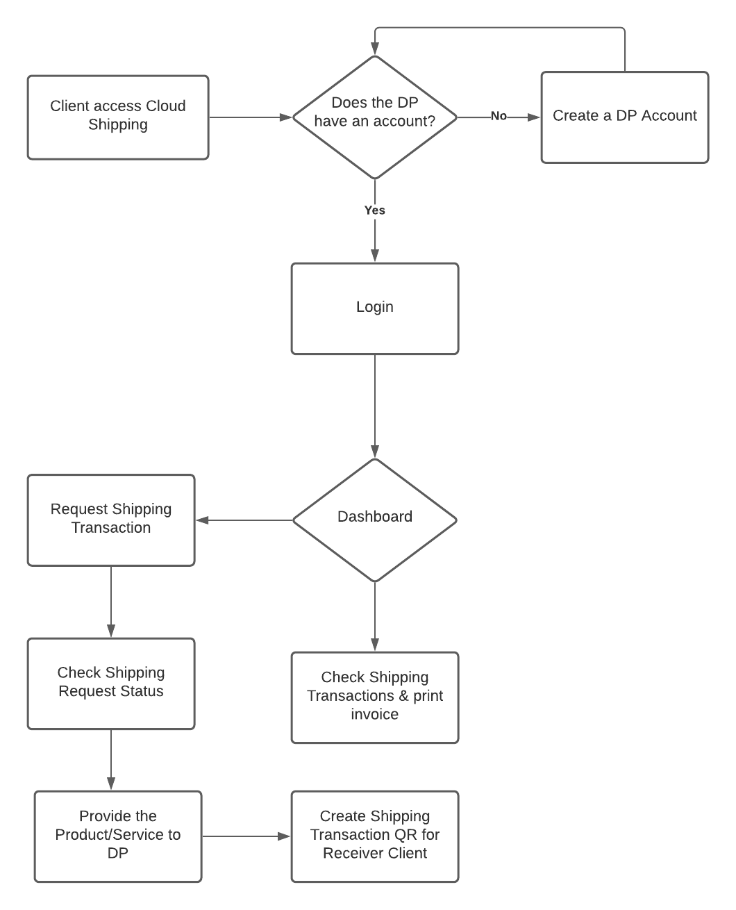
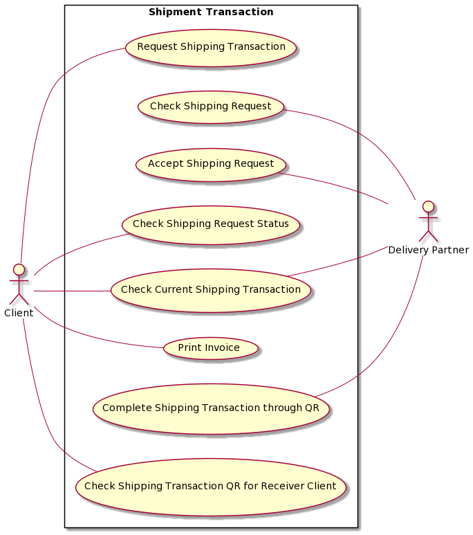
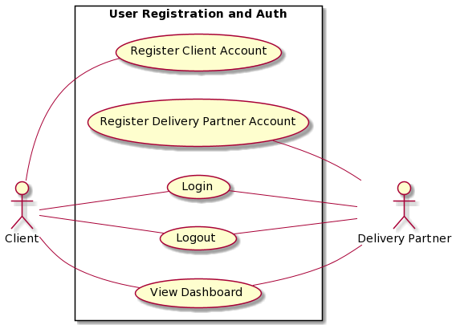

# Cloud Shipping
Transforming the Shipping and Business Industry for the Next Generation

<p align="center">
    
    
</p>

## Table of Contents
* [General info](#general-info)
* [Technologies](#technologies)
* [Prerequisite](#prerequisite)
* [Setup](#setup)
* [Live Deployment](#live-deployment)


## General info
Cloud Shipping provides services that fulfills individuals, business owners, and large organizations shipping transaction in a delightful experience through managing transactions and automate all your shipping needs. 


## Technologies
The Frontend/Client side of the project is created with:
* [Axios](https://www.npmjs.com/package/axios)
* [JWT](https://www.npmjs.com/package/jsonwebtoken)
* [Kutty](https://www.npmjs.com/package/kutty)
* [Moment](https://www.npmjs.com/package/moment)
* [React-Hot-Toast](https://www.npmjs.com/package/react-hot-toast)
* [React-Responsive](https://www.npmjs.com/package/react-hot-toast)
* [React-Sliding-Side-Panel](https://www.npmjs.com/package/react-hot-toast)
* [Redux](https://www.npmjs.com/package/@reduxjs/toolkit)
* [Redux Toolkit](https://www.npmjs.com/package/@reduxjs/toolkit)
* [React](https://reactjs.org/docs/create-a-new-react-app.html)
* [Tailwind CSS](https://reactjs.org/docs/create-a-new-react-app.html)

## User Workflows
* [Client](https://github.com/Klylylydeee/tps_cloud_shipping_fe)
<p align="center">
    
</p>

* [Delivery Partner](https://github.com/Klylylydeee/tps_cloud_shipping_fe)
<p align="center">
    
</p>

* [External Users](https://github.com/Klylylydeee/tps_cloud_shipping_fe)
<p align="center">
    
</p>

## Entity Relationship Diagram
Collection Schemas:
* [Client](https://github.com/Klylylydeee/tps_cloud_shipping_fe)
* [Delivery_Partner](https://github.com/Klylylydeee/tps_cloud_shipping_fe)
* [Business_Partner](https://github.com/Klylylydeee/tps_cloud_shipping_fe)
* [Address](https://github.com/Klylylydeee/tps_cloud_shipping_fe)
* [Vehicles](https://github.com/Klylylydeee/tps_cloud_shipping_fe)
* [Shipping_Transaction_User_Information](https://github.com/Klylylydeee/tps_cloud_shipping_fe)
* [Shipping_Transaction](https://github.com/Klylylydeee/tps_cloud_shipping_fe)
* [Shipping_Status](https://github.com/Klylylydeee/tps_cloud_shipping_fe)
* [Shipping_Products_List](https://github.com/Klylylydeee/tps_cloud_shipping_fe)
* [Product](https://github.com/Klylylydeee/tps_cloud_shipping_fe)

<p align="center">
    
</p>

## Unified Model Language

<p align="center">
    
    
</p>

## Prerequisite
Install the following:
* [node.js](https://nodejs.org/en/)
* [yarn](https://classic.yarnpkg.com/en/docs/)

Clone the repository
```
git clone https://github.com/Klylylydeee/tps_cloud_shipping_fe
```

Install the dependencies
```
cd tps_cloud_shipping_fe && yarn install
```

## Setup
To run this project and run it locally:
```
cd tps_cloud_shipping_fe && yarn start
```


## Live Deployment
FrontEnd/Client side
```
https://cloud-shipping.netlify.app/
```

BackEnd/Server side
```
https://cloud-shipping.heroku.app/
```
